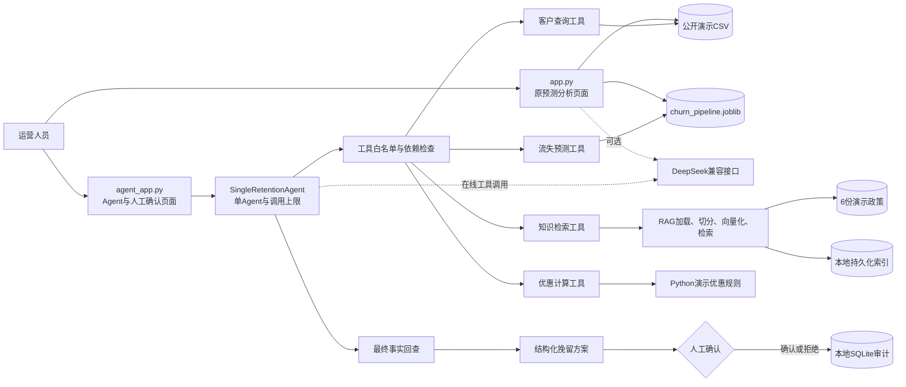

# 客户流失预测与智能运营 Agent

## 1. 项目背景

本项目基于公开的 Telco Customer Churn 数据，将传统客户流失预测升级为一个
可追溯、可拒答、需要人工确认的运营辅助系统。系统保留原有 `app.py`，并通过
独立的 `agent_app.py` 增加客户查询、模型预测、政策检索、确定性优惠计算、单
Agent 编排和本地审计。

项目的目标是演示从数据分析到 Agent 工具调用的完整技术链路，不代表真实运营商
系统，不会自动联系客户、修改套餐或发放优惠，也没有验证真实留存效果。

## 2. 系统架构



原页面与 Agent 页面相互独立。Agent 只能调用四个注册工具，不能直接读取文件或
自行计算概率、政策来源和优惠金额。

## 3. 数据流

1. 用户在 `agent_app.py` 选择 `customerID` 并输入自然语言任务。
2. Agent 调用客户查询工具，从公开演示 CSV 取得模型所需的 19 个字段。
3. 流失预测工具加载已训练 Pipeline，复用训练时的预处理和逻辑回归，输出概率。
4. 普通 Python 规则将概率映射为低、中、高风险，并生成 EDA 风险信息。
5. RAG 从演示政策中检索带文件、标题、章节、片段和 MD5 的证据。
6. 优惠工具根据风险、合同和月消费执行固定规则，不允许大模型生成金额。
7. Agent 生成结构化方案；Python 再与全部工具结果逐字段核对。
8. 页面先将方案写入SQLite并标记为“待人工确认”；人工确认或拒绝后，事务性更新
   审计状态。未确认的方案不会标记为已执行。

## 4. 四个业务工具

| 工具 | 输入 | 输出 | 关键约束 |
|---|---|---|---|
| 客户查询 | `customerID` | 客户编号和19个模型字段 | 不返回 `Churn`；不存在时返回明确错误 |
| 流失预测 | 19个训练字段 | 概率、0.40阈值、类别、风险等级、风险因素 | 只加载现有Pipeline，不执行训练 |
| 知识检索 | 问题、Top K、阈值 | 文本片段及来源元数据 | 无依据时返回空证据，不编造 |
| 优惠计算 | 风险等级、合同、月消费 | 比例、期限、月优惠、合计优惠、审批标记 | 全部由Python演示规则确定 |

所有工具输入输出都使用 Pydantic，并可脱离 Agent 单独测试。

## 5. RAG流程

RAG 只读取 `knowledge/demo_telecom/` 中 6 份 Markdown 演示政策，不读取客户
CSV。流程为：

```text
加载Markdown → 校验演示声明 → 规范化文本 → MD5去重 → 分章节切分
→ Hashing向量化 → Joblib本地持久化 → 相似度检索 → 来源保留/无依据拒答
```

- 当前知识库：6份唯一文档、33个片段、65,536维向量。
- 文档增删改时按清单增量更新；索引损坏或版本不兼容时完整重建。
- MD5只用于规范化内容去重，不作为安全哈希。
- Joblib基于pickle，只应加载本项目自身生成的受信任文件。

## 6. Agent决策流程

单 Agent 使用 DeepSeek 的 OpenAI 兼容接口执行工具调用，固定注册：

1. `get_customer_profile`
2. `predict_churn_risk`
3. `search_retention_policy`
4. `calculate_retention_offer`

预测依赖同一客户的查询结果，优惠依赖查询和预测结果。默认最多调用工具8次。
未注册工具、customerID不一致、工具失败或超过调用上限都会立即停止。

最终 JSON 不只做格式校验，还会核对客户字段、概率、风险因素、RAG原文和完整优惠
对象。模型修改任何权威字段时返回 `FINAL_OUTPUT_INVALID`。

## 7. 人工确认与审计

Agent 成功生成方案后，SQLite中只建立“待人工确认”记录，不会自动标记执行。

- 点击“确认执行”：审计写入成功后显示“已确认执行（项目演示记录）”。
- 点击“拒绝方案”：写入拒绝记录，方案不得执行。
- 审计写入失败：页面显示错误，状态保持不变。

本地数据库位于 `storage/audit/agent_decisions.sqlite3`，记录 UTC 时间、客户ID、决策、
方案指纹和摘要。相同方案指纹只建一条记录，重复确认不会生成重复执行记录；刷新
页面后可查看最近的审计历史。它已被 Git 忽略，且当前没有真实业务下发接口。旧
JSONL审计代码保留用于兼容，当前页面不再向旧文件写入。需要导出已完成的决策时运行：

```powershell
python scripts/export_audit.py
```

导出文件为 `storage/audit/agent_decisions_export.jsonl`，不会覆盖旧审计文件。

## 8. 安装与运行

### 8.1 环境

项目本地 `.venv` 的最终验收环境为 Python 3.13.2、scikit-learn 1.6.1；另在
Python 3.13.5 的 Conda 环境完成兼容复验。模型由 scikit-learn 1.6.1 保存，必须
使用兼容版本加载。

```powershell
python -m venv .venv
.\.venv\Scripts\Activate.ps1
python -m pip install --upgrade pip
python -m pip install -r requirements.txt
python -m pip check
python -c "import sklearn; print(sklearn.__version__)"
```

最后一条命令应输出 `1.6.1`。本机另一套默认 Python 使用 scikit-learn 1.7.2，
不能加载当前模型文件，不属于通过验收的运行环境。

### 8.2 密钥

新 Agent 的 DeepSeek 密钥只能通过环境变量提供。建议在 Windows“编辑账户的环境
变量”中新增用户变量 `DEEPSEEK_API_KEY`，然后重新打开终端和应用。不要把真实
Key 直接写入 PowerShell 命令历史。可用下列命令只检查是否配置，不显示内容：

```powershell
if ($env:DEEPSEEK_API_KEY) { "已配置" } else { "未配置" }
```

可选变量见 `.env.example`。原 `app.py` 优先读取 `DEEPSEEK_API_KEY`，没有时才
回退到被 Git 忽略的 `.streamlit/secrets.toml`；新模块不读取该文件。不要把真实密钥
写入源码、README或示例文件。

### 8.3 启动

原预测分析页面：

```powershell
python -m streamlit run app.py
```

Agent与人工确认页面：

```powershell
python -m streamlit run agent_app.py
```

独立命令：

```powershell
python scripts/build_rag_index.py
python scripts/query_rag.py "高风险客户的演示挽留政策是什么？"
python scripts/demo_business_tools.py
python scripts/run_agent.py "请为客户 7590-VHVEG 生成完整挽留方案"
```

## 9. 测试与评估结果

最终验收命令：

```powershell
python -m unittest discover -v
python scripts/test_rag.py
python scripts/test_agent.py
python scripts/run_acceptance.py
python scripts/security_scan.py --history
python scripts/test_deepseek_retention.py --offline
```

配置好 `DEEPSEEK_API_KEY` 后，可选择运行一次真实的最小调用：

```powershell
python scripts/test_deepseek_retention.py
```

此命令会产生网络请求及可能的费用，不属于下列离线验收结果。

2026-09-21 在验收环境中的结果：

- 单元与页面测试：31/31通过。
- RAG问题集：7/7通过。
- Agent完整自然语言任务：5/5通过。
- 最终验收清单：15/15通过，覆盖客户存在/不存在、高中低风险、预测工具、政策
  检索、无依据、优惠边界、工具异常、人工确认/拒绝和循环保护。
- `app.py` 与 `agent_app.py` 的 Streamlit测试均为0异常；实际启动后的健康检查均为
  `200 ok`。
- 安全扫描：当前源码及已提交Git历史未发现硬编码真实密钥；源码未发现机器绝对
  路径或知识库 customerID。扫描属于模式检测，不能替代人工密钥轮换。

同日另做了有限的真实DeepSeek在线验证：虚拟客户结构化建议通过；公开演示客户
`7590-VHVEG` 的完整Agent调用按顺序执行客户查询、预测、政策检索和优惠计算，并
通过最终事实回查。首次完整调用虽正确执行四类工具，但最终行动话术触发安全校验，
被拒绝；明确禁用词及其否定形式后，复测通过。不存在客户的在线任务仅调用客户
查询一次，返回 `CUSTOMER_NOT_FOUND`。无依据问题由独立RAG拒答，未进行完整在线
Agent无依据任务测试。上述在线结果是少量样例，不代表稳定性或生产效果。

评估清单位于 `evaluation/final_acceptance_cases.json`。

## 10. 模型结果

使用项目选定的 0.40 分类阈值：

- Accuracy：0.777
- Precision：0.568
- Recall：0.668
- F1：0.614
- ROC-AUC：0.842

指标来自现有公开数据划分和项目 Notebook，不等同于生产环境效果。

## 11. 演示数据与隐私声明

- `telco_customer_churn.csv` 是公开演示数据，不是真实企业客户数据。
- `knowledge/demo_telecom/` 全部是项目演示政策，不是真实运营商内部政策。
- 演示优惠不是可执行资费，金额沿用数据集未指定计费单位。
- 客户 CSV、customerID 和个人字段不会写入 RAG 向量库。
- 测试中的固定 customerID 来自公开演示数据。
- 本地审计数据库包含 customerID，已被 Git 忽略；生产场景仍需访问控制、脱敏和留存
  周期管理。

## 12. 项目目录

```text
agent/                 单Agent、工具注册、结构校验、人工审计
business_tools/        四个可独立测试的业务工具
knowledge/             6份Markdown演示政策
rag/                   加载、切分、向量存储、检索与拒答
evaluation/            RAG、Agent和最终验收用例
tests/                 业务工具、Agent、页面、审计和验收测试
scripts/               构建、查询、直调、测试、安全扫描入口
app.py                 原预测分析Streamlit页面
agent_app.py           Agent与人工确认Streamlit页面
churn_pipeline.joblib  已训练的完整Pipeline
telco_customer_churn.csv 公开演示数据
```

## 13. 已知限制

- 当前使用逻辑回归基线，没有模型漂移监控、线上反馈或A/B测试。
- 风险规则和0.40/0.60边界是项目演示规则，EDA关联不能证明因果。
- RAG使用字符级Hashing向量，语义召回能力弱于专业Embedding。
- 知识库和优惠均为演示内容，不能作为真实企业决策依据。
- SQLite审计具有事务和重复确认保护，但仍只适合单机演示；没有用户身份认证、
  权限管理、防篡改或经验证的高并发保障。
- 当前没有真实客户触达、套餐修改、优惠审批或下发接口。
- 仅做少量真实DeepSeek在线验证，尚未系统评估不同措辞、模型波动、限流与超时；
  原 `app.py` 的DeepSeek请求未在线复验。
- 新增Agent模块只使用环境变量；为保持原页面不变，旧 `app.py` 在缺少环境变量时仍
  回退到被Git忽略的Streamlit本地密钥文件。
- 安全扫描覆盖当前工作区源码，不等同于对Git历史、备份文件或运行主机的完整密钥
  审计；本地密钥文件中的值如果曾外泄，仍需在服务商控制台轮换。
- 尚未进行高并发、渗透测试、公网部署或生产级监控验证。
