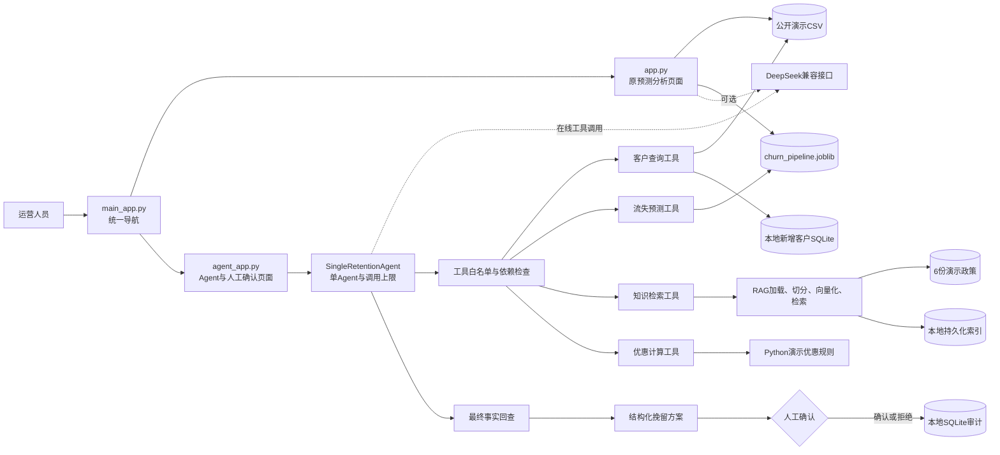

# 客户流失预测与智能运营 Agent

## 1. 项目背景

本项目基于公开的 Telco Customer Churn 数据，将传统客户流失预测升级为一个
可追溯、可拒答、需要人工确认的运营辅助系统。系统保留原有 `app.py`，通过
独立的 `agent_app.py` 增加客户查询、模型预测、政策检索、确定性优惠计算、单
Agent 编排和本地审计。

`main_app.py` 提供统一导航入口，但原有两个页面仍可独立启动。新增演示客户
保存在本地独立 SQLite，不写回训练 CSV；页面明确标记训练集、测试集或自定义来源。

项目的目标是演示从数据分析到 Agent 工具调用的完整技术链路，不代表真实运营商
系统，不会自动联系客户、修改套餐或发放优惠，也没有验证真实留存效果。

## 2. 系统架构


```mermaid
flowchart LR
    U[运营人员] --> NAV[main_app.py<br/>统一导航]
    NAV --> OLD[app.py<br/>原预测分析页面]
    NAV --> UI[agent_app.py<br/>Agent与人工确认页面]

    OLD --> CSV[(公开演示CSV)]
    OLD --> MODEL[(churn_pipeline.joblib)]
    OLD -. 可选 .-> DS[DeepSeek兼容接口]

    UI --> AGENT[SingleRetentionAgent<br/>单Agent与调用上限]
    AGENT -. 在线工具调用 .-> DS
    AGENT --> REG[工具白名单与依赖检查]
    REG --> T1[客户查询工具]
    REG --> T2[流失预测工具]
    REG --> T3[知识检索工具]
    REG --> T4[优惠计算工具]

    T1 --> CSV
    T1 --> CUSTOM[(本地新增客户SQLite)]
    T2 --> MODEL
    T3 --> RAG[RAG加载、切分、向量化、检索]
    RAG --> KB[(6份演示政策)]
    RAG --> INDEX[(本地持久化索引)]
    T4 --> RULES[Python演示优惠规则]

    AGENT --> VERIFY[最终事实回查]
    VERIFY --> PLAN[结构化挽留方案]
    PLAN --> HUMAN{人工确认}
    HUMAN -->|确认或拒绝| AUDIT[(本地SQLite审计)]
```

原页面与 Agent 页面相互独立。Agent 只能调用四个注册工具，不能直接读取文件或
自行计算概率、政策来源和优惠金额。

## 3. 数据流

1. 用户从统一入口或独立 Agent 页面选择公开客户，也可填写 19 个字段新增演示客户。
2. Agent 调用客户查询工具，先查独立的自定义客户 SQLite，再查公开 CSV，只取得模型所需的 19 个字段。
3. 流失预测工具加载已训练 Pipeline，复用训练时的预处理和逻辑回归，输出概率。
4. 普通 Python 规则将概率映射为低、中、高风险，并生成 EDA 风险信息。
5. RAG 从演示政策中检索带文件、标题、章节、片段和 MD5 的证据。
6. 优惠工具根据风险、合同和月消费执行固定规则，不允许大模型生成金额。
7. Agent 生成结构化方案；Python 再与全部工具结果逐字段核对。
8. 页面先将方案写入SQLite并标记为“待人工确认”；人工确认或拒绝后，事务性更新
   审计状态。未确认的方案不会标记为已执行。

## 4. 四个业务工具

| 工具 | 输入 | 输出 | 关键约束 |
|---|---|---|---|
| 客户查询 | `customerID` | 客户编号和19个模型字段 | 不返回 `Churn`；不存在时返回明确错误 |
| 流失预测 | 19个训练字段 | 概率、0.40阈值、类别、风险等级、风险因素 | 只加载现有Pipeline，不执行训练 |
| 知识检索 | 问题、Top K、阈值 | 文本片段及来源元数据 | 无依据时返回空证据，不编造 |
| 优惠计算 | 风险等级、合同、月消费 | 比例、期限、月优惠、合计优惠、审批标记 | 全部由Python演示规则确定 |

所有工具输入输出都使用 Pydantic，并可脱离 Agent 单独测试。

## 5. RAG流程

RAG 只读取 `knowledge/demo_telecom/` 中 6 份 Markdown 演示政策，不读取客户
CSV。流程为：

```text
加载Markdown → 校验演示声明 → 规范化文本 → MD5去重 → 分章节切分
→ Hashing向量化 → Joblib本地持久化 → 相似度检索 → 来源保留/无依据拒答
```

- 当前知识库：6份唯一文档、33个片段、65,536维向量。
- 文档增删改时按清单增量更新；索引损坏或版本不兼容时完整重建。
- MD5只用于规范化内容去重，不作为安全哈希。
- Joblib基于pickle，只应加载本项目自身生成的受信任文件。

## 6. Agent决策流程

单 Agent 使用 DeepSeek 的 OpenAI 兼容接口执行工具调用，固定注册：

1. `get_customer_profile`
2. `predict_churn_risk`
3. `search_retention_policy`
4. `calculate_retention_offer`

预测依赖同一客户的查询结果，优惠依赖查询和预测结果。默认最多调用工具8次。
未注册工具、customerID不一致、工具失败或超过调用上限都会立即停止。

最终 JSON 不只做格式校验，还会核对客户字段、概率、风险因素、RAG原文和完整优惠
对象。模型修改任何权威字段时返回 `FINAL_OUTPUT_INVALID`。

## 7. 人工确认与审计

Agent 成功生成方案后，SQLite中只建立“待人工确认”记录，不会自动标记执行。

- 点击“确认执行”：审计写入成功后显示“已确认执行（项目演示记录）”。
- 点击“拒绝方案”：写入拒绝记录，方案不得执行。
- 审计写入失败：页面显示错误，状态保持不变。

本地数据库位于 `storage/audit/agent_decisions.sqlite3`，记录 UTC 时间、客户ID、决策、
方案指纹和摘要。相同方案指纹只建一条记录，重复确认不会生成重复执行记录；刷新
页面后可查看最近的审计历史。它已被 Git 忽略，且当前没有真实业务下发接口。旧
JSONL审计代码保留用于兼容，当前页面不再向旧文件写入。需要导出已完成的决策时运行：

```powershell
python scripts/export_audit.py
```

导出文件为 `storage/audit/agent_decisions_export.jsonl`，不会覆盖旧审计文件。

## 8. 安装与运行

### 8.1 环境

项目本地 `.venv` 的旧最终验收环境为 Python 3.13.2、scikit-learn 1.6.1；另在
Python 3.13.5 的 Conda 环境完成兼容复验。模型由 scikit-learn 1.6.1 保存，必须
使用兼容版本加载。

```powershell
python -m venv .venv
.\.venv\Scripts\Activate.ps1
python -m pip install --upgrade pip
python -m pip install -r requirements.txt
python -m pip check
python -c "import sklearn; print(sklearn.__version__)"
```

统一页面的运行命令是：

```powershell
streamlit run main_app.py
```

侧栏可在原预测页面与 Agent 页面之间切换；原命令 `streamlit run app.py` 和
`streamlit run agent_app.py` 仍可使用。Agent 页面选择“添加自定义客户”，填完
19 个模型字段并保存，再生成方案。新客户写入 `storage/customers/demo_customers.sqlite3`
（被 Git 忽略），不进入 `telco_customer_churn.csv`、Notebook 训练或 RAG 索引。
客户 ID 必须符合 `0000-AAAAA` 格式，且不能与原 CSV 重复。

最后一条命令应输出 `1.6.1`。本机另一套默认 Python 使用 scikit-learn 1.7.2，
不能加载当前模型文件，不属于通过验收的运行环境。

### 8.2 密钥

新 Agent 的 DeepSeek 密钥只能通过环境变量提供。建议在 Windows“编辑账户的环境
变量”中新增用户变量 `DEEPSEEK_API_KEY`，然后重新打开终端和应用。不要把真实
Key 直接写入 PowerShell 命令历史。可用下列命令只检查是否配置，不显示内容：

```powershell
if ($env:DEEPSEEK_API_KEY) { "已配置" } else { "未配置" }
```

可选变量见 `.env.example`。原 `app.py` 优先读取 `DEEPSEEK_API_KEY`，没有时才
回退到被 Git 忽略的 `.streamlit/secrets.toml`；新模块不读取该文件。不要把真实密钥
写入源码、README或示例文件。

### 8.3 启动

原预测分析页面：

```powershell
python -m streamlit run app.py
```

Agent与人工确认页面：

```powershell
python -m streamlit run agent_app.py
```

独立命令：

```powershell
python scripts/build_rag_index.py
python scripts/query_rag.py "高风险客户的演示挽留政策是什么？"
python scripts/demo_business_tools.py
python scripts/run_agent.py "请为客户 7590-VHVEG 生成完整挽留方案"
```

## 9. 测试与评估结果

最终验收命令：

```powershell
python -m unittest discover -v
python scripts/test_rag.py
python scripts/test_agent.py
python scripts/run_acceptance.py
python scripts/security_scan.py --history
python scripts/test_deepseek_retention.py --offline
```

配置好 `DEEPSEEK_API_KEY` 后，可选择运行一次真实的最小调用：

```powershell
python scripts/test_deepseek_retention.py
```

此命令会产生网络请求及可能的费用，不属于下列离线验收结果。

**当前离线复验结果（2026-09-24，项目 `.venv`）：**

- 单元与页面测试：40/40 通过，包含统一入口切换至 Agent 页。
- RAG 问题集：16/16 通过。
- Agent 完整自然语言任务：8/8 通过，其中 3 条标记为独立测试集样例。
- 最终验收清单：15/15 通过，覆盖客户存在/不存在、高中低风险、预测工具、政策
  检索、无依据、优惠边界、工具异常、人工确认/拒绝和循环保护。
- 原独立页面与统一入口的页面测试均无异常；统一入口启动时健康检查返回 HTTP 200。
- 安全扫描：当前源码及已提交Git历史未发现硬编码真实密钥；源码未发现机器绝对
  路径或知识库 customerID。扫描属于模式检测，不能替代人工密钥轮换。

初次验收（2026-09-21）的较小用例集与当时页面操作细节保留在
`docs/acceptance_report.md`，不应与当前测试总数混用。

同日另做了有限的真实DeepSeek在线验证：虚拟客户结构化建议通过；原 `app.py`
经页面按钮触发的 DeepSeek 建议生成成功；公开演示客户
`7590-VHVEG` 的完整Agent调用成功执行客户查询、预测、政策检索和优惠计算，并
通过最终事实回查。首次完整调用虽正确执行四类工具，但最终行动话术触发安全校验，
被拒绝；明确禁用词及其否定形式后，复测通过。不存在客户的在线任务仅调用客户
查询一次，返回 `CUSTOMER_NOT_FOUND`。本轮另对中风险客户 `8012-SOUDQ` 完成真实
Agent调用，四个工具均成功并通过最终字段核对。无依据问题由独立RAG拒答，未进行完整在线
Agent无依据任务测试。上述在线结果是少量样例，不代表稳定性或生产效果。
Agent 页面也通过真实按钮交互生成方案，并在本地 SQLite 创建待人工确认记录；
本轮没有点击确认或拒绝按钮，真实客户触达或优惠下发仍不存在。

评估清单位于 `evaluation/final_acceptance_cases.json`，完整报告见
`docs/acceptance_report.md`。

展示改进后，新增客户持久化、独立数据库查询、离线完整 Agent 链路、来源划分
及统一入口测试已通过。离线 Agent 用例使用大模型替身，不等同于真实在线调用；
页面自动化和健康检查也不等同于生产部署或人工浏览器验收。

虚拟新客户保存、四工具方案及拒绝审计的独立离线脚本通过。随后在 Windows 用户账户环境
运行两次真实 DeepSeek 虚拟客户任务：首次四工具和最终方案成功，但验收脚本对
政策检索与预测的先后顺序施加了不存在的依赖，因而脚本判失败；修正为真实业务
依赖后，第二次在线任务通过，并完成高风险预测、演示政策引用、Python 优惠金额
及人工拒绝的本地审计。细节见 `docs/four_improvements.md`。这仅是少量在线样例，
不代表大规模成功率或生产环境可用性。

## 10. 模型结果

### 阈值对比

分类阈值决定“概率多高才判为会流失”。`02_ml_pipeline.ipynb` 对测试集做了阈值
扫描（判定条件为 `proba >= threshold`），已保存的输出如下：

| 阈值 | Precision | Recall | F1 | FP（误判为流失） | FN（漏判的流失） |
|---|---|---|---|---|---|
| 0.50（scikit-learn 默认） | 0.657 | 0.559 | 0.604 | 109 | 165 |
| 0.45 | 0.602 | 0.615 | 0.608 | 152 | 144 |
| **0.40（项目演示选用）** | 0.568 | 0.668 | 0.614 | 190 | 124 |
| 0.35 | 0.543 | 0.706 | 0.614 | 222 | 110 |

上表是 Notebook 直接输出的指标。Accuracy 由同一批预测另算，对应值为
0.806 / 0.790 / 0.777 / 0.764（按阈值从高到低）。ROC-AUC 为 0.842，与阈值无关。

0.40 是挽留场景的取舍：漏掉一个要流失的客户，比多送一次优惠更贵。从 0.50 降到
0.40，**漏判的流失客户从 165 人降到 124 人（少漏 41 人），代价是多出 81 个被
误判为会流失的客户**。真实业务应结合挽留成本和客单价算期望收益，**0.40 是项目
演示值，不是业务方给定的标准**。

**为什么不再降到 0.35**：F1 与 0.40 持平（都是 0.614），Precision 却继续降到
0.543，只换来少漏 14 人、多误判 32 人。0.40 是这条曲线上性价比较好的拐点。

**风险分级边界与判定阈值不是一回事**：0.40 是二分类判定阈值（判不判为流失）；
0.60 是风险分级边界。低风险 < 0.40，中风险 0.40–0.60，高风险 ≥ 0.60。

**复现方式**：`02_ml_pipeline.ipynb` 的阈值扫描单元已包含 P/R/F1/FP/FN 并保存了
输出，无需重跑。若脱离 Notebook 复现，用 `churn_pipeline.joblib` 对同一测试集
划分计算 `predict_proba` 再按上表阈值判定即可。注意 `TotalCharges` 列含空字符串
（对应 tenure 为 0 的新客户），必须先 `astype(str).str.strip().replace('', '0')`
再 `pd.to_numeric`，否则会抛 `could not convert string to float`。

指标来自现有公开数据划分和项目 Notebook，不等同于生产环境效果。

## 11. 演示数据与隐私声明

- `telco_customer_churn.csv` 是公开演示数据，不是真实企业客户数据。
- `knowledge/demo_telecom/` 全部是项目演示政策，不是真实运营商内部政策。
- 演示优惠不是可执行资费，金额沿用数据集未指定计费单位。
- 客户 CSV、customerID 和个人字段不会写入 RAG 向量库。
- 测试中的固定 customerID 来自公开演示数据。
- `evaluation/agent_tasks.json` 原有五条客户均属于训练集，只用于工具链演示；
  新增三条高、中、低风险客户属于按 Notebook 参数复现的独立测试集。后者也仅是
  单例链路验证，不能用三条用例重新计算或替代完整测试集指标。
- 手工新增客户只保存在本地 SQLite；请勿录入真实姓名、电话、地址或敏感资料。
- 本地审计数据库包含 customerID，已被 Git 忽略；生产场景仍需访问控制、脱敏和留存
  周期管理。

## 12. 项目目录

```text
agent/                 单Agent、工具注册、结构校验、人工审计
business_tools/        四个可独立测试的业务工具
knowledge/             6份Markdown演示政策
rag/                   加载、切分、向量存储、检索与拒答
evaluation/            RAG、Agent和最终验收用例
tests/                 业务工具、Agent、页面、审计和验收测试
scripts/               构建、查询、直调、测试、安全扫描入口
docs/                  验收报告与功能验证说明
app.py                 原预测分析Streamlit页面
agent_app.py           Agent与人工确认Streamlit页面
main_app.py            两个现有页面的统一导航入口
business_tools/customer_store.py  自定义演示客户的独立SQLite存储
business_tools/data_provenance.py  复现训练/测试划分并标注客户来源
churn_pipeline.joblib  已训练的完整Pipeline
telco_customer_churn.csv 公开演示数据
```

## 13. 已知限制

- 当前使用逻辑回归基线，没有模型漂移监控、线上反馈或A/B测试。
- 风险规则和0.40/0.60边界是项目演示规则，EDA关联不能证明因果。
- RAG使用字符级Hashing向量，语义召回能力弱于专业Embedding。
- 新增检索评估中，“光纤客户反映网速不稳定时应先核查什么？”这一口语问法
  原先未达到相似度阈值；现由 `rag/query_normalization.py` 对明确的电信服务质量
  问法做少量确定性同义扩展，原问题与“网络很卡”均已进入检索回归集且通过。
  这不是通用语义检索，未覆盖的口语问法仍可能漏检。
- 自定义客户是演示录入，不参与模型重新训练；没有真实客户身份核验、权限控制
  或数据生命周期管理。来源划分按当前 Notebook 的随机种子、分层标签和 CSV 行序
  复现；若数据或训练代码变动，需重新核对来源标记。
- 知识库和优惠均为演示内容，不能作为真实企业决策依据。
- SQLite审计具有事务和重复确认保护，但仍只适合单机演示；没有用户身份认证、
  权限管理、防篡改或经验证的高并发保障。
- 当前没有真实客户触达、套餐修改、优惠审批或下发接口。
- 仅做少量真实DeepSeek在线验证，尚未系统评估不同措辞、模型波动、限流与超时。
- 新增Agent模块只使用环境变量；为保持原页面不变，旧 `app.py` 在缺少环境变量时仍
  回退到被Git忽略的Streamlit本地密钥文件。
- 安全扫描覆盖当前工作区源码，不等同于对Git历史、备份文件或运行主机的完整密钥
  审计；本地密钥文件中的值如果曾外泄，仍需在服务商控制台轮换。
- 尚未进行高并发、渗透测试、公网部署或生产级监控验证。
